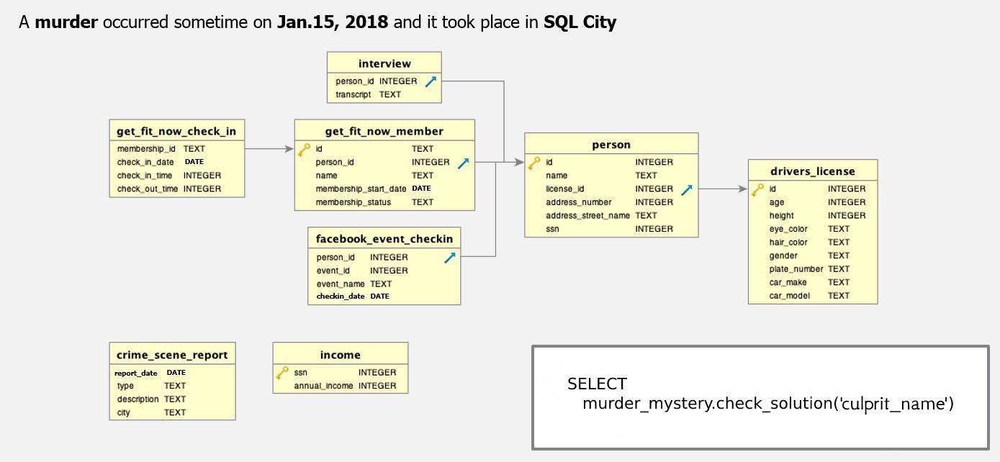

# Snowplow Analytics Engineering Technical Test

Please complete 2 of the following 3 exercises, depending on your preference and experience. Both the SQL and dbt exercises make use of the same Docker image. If you don't have Docker installed, please check their [getting started](https://www.docker.com/get-started/) docs. Each exercise is expected to take you around 30-60 minutes, depending on your experience.

In all the exercises we are not looking for a perfect solution, but how you approach the challenges and work through solving any issues while working with data. Even if you are unable to fully complete the task(s), please submit what you have done so far. 

Please submit your solutions in a format appropriate for each task, make sure to include comments in any code and feel free to provide any other context or additional materials that will help us understand your work. If you have any questions please reach out.

## Docker Image Setup and Usage
To get started, please ensure you have [docker](https://docs.docker.com/) installed on your machine, docker desktop is also recommended for easier management of containers.

Once docker is installed, simply run `docker compose up`, or `docker compose up -d` to run it detached. This will start a postgres warehouse available on port 5432, with a username of `admin` and a password of `password` and will begin to populate the warehouse with the training data required. This should take a few minutes depending on your hardware and will only need to be done the first time the container is created. You should connect using your preferred tool e.g. VScode, or a version of pgAdmin has also been included in the image and will be available on http://localhost:5050/, with a username of `admin@admin.com` and a password of `password` .

To add a connection for pgAdmin, right-click on `Servers` once logged in, then `Register -> Server`, give it whatever name you want and in the connection tab use the following details:

- Host name/address: `host.docker.internal`
- Maintenance Database: `tech_test`
- Username: `admin`
- Password: `password`
- Save password

Leave the remaining unchanged. To start writing SQL Queries, expand the left side bar until you see the `tech_test` warehouse then right-click and select `Query Tool`.

# Exercises
## SQL Exercise
The database within the postgres image contains a schema called `murder_mystery`, which has the below ERD. 

A crime has taken place and the detective needs your help. The detective gave you the crime scene report, but you somehow lost it. You vaguely remember that the crime was a murder​​ that occurred sometime on ​Jan.15, 2018​​ and that it took place in SQL City​​.

All the clues to this mystery are buried in the database, and you need to use SQL to navigate through this vast network of information. Your first step to solving the mystery is to retrieve the corresponding crime scene report from the police department’s database.

The goal is to end up with as few queries as possible, by taking advantage of various SQL features, and to avoid hard-coding information where possible. In some cases this is unavoidable, so do not focus on reducing the number of SQL queries beyond what seems sensible to reduce re-work should some data records change in the future.

You can validate that you have found the correct solution by using the `check_soltuion` function in the `murder_mystery` schema.

## dbt Exercise
The database within the postgres image contains a schema called `nycflights`, which is based on the [nycflights13](https://cran.r-project.org/web/packages/nycflights13/nycflights13.pdf) dataset from R. There may be some differences in column names or types, and there may be some additional or missing columns compared to the original data.

We have provided you with an empty dbt project, with the profile already configure, in the `dbt_project` folder. You are tasked with building a project that will enable people to more easily produce reporting and insights from the data. Consider things such as making it easy to make reports without having to do any joins from your tables, good project structure, and documentation.

1. Add the 5 tables as sources within the project
2. Create suitable models that will help with the following topics:
   1. Reporting on delayed flights; by airline and plane type
   2. The impact of wind speed on flight duration
   3. The usage of plane stock for each month of 2013
3. Discuss how you might change these models to make them incremental assuming new data was added to table each day. (You do not need to make these changes to the models, just discuss the impact and things you will need to consider.)

## Python Exercise
We are looking for a well-commented python script that completes the following steps.

The files you will need are:

* `data/download_speed_measurements.csv`
* `data/upload_speed_measurements.csv`
* `data/details_for_each_person.csv`

Field descriptions are in `data/DATA_DICTIONARY.md`.

### Import and transform
Please import these files and combine them into a single table that:

* has the structure `person_id, city, type_of_broadband_connection, name_of_isp, average_download_speed, average_upload_speed`
* has 1 line per person (i.e. calculate a single average download and upload speed for each person)
* only contains people in the cities 'Samsville' and 'Databury'
* only contains download and upload measurements that have run successfully (i.e. put a filter on did_test_complete_successfully)
* only contains tests run in the month of January 2021 (i.e. put a filter on time_of_measurement).

There are alternative summary statistics used to measure download speed that are more nuanced than a simple average. An example is the average download speed each day, and take the 60th percentile. The value of this metric tells you that 'on at least 60% of days, average download speed was at least x.'

Calculate this metric for each person in the dataset and add it into your table.

### Data quality

Like any dataset, this one has problems; for example:
  * There are people in different cities
  * People who have differing rates of missing data
  * There are people with average speeds that are either too high or too low for their `type_of_broadband_connection` (i.e. mislabeled data)
  * There are people who have OK data overall, but some individual tests fall outside of parameters.

Investigate the extent to which these problems appear in the dataset, also whether - and to what extent - they affect your results. Suggest any relevant follow-up investigations or corrective steps to apply to the data.

### Visualization
Make a visualization of the distribution of average download speeds by ISP by city by connection type, which is designed so that a technically aware stakeholder can read the graph and see the differences between ISP for each package in each city.
